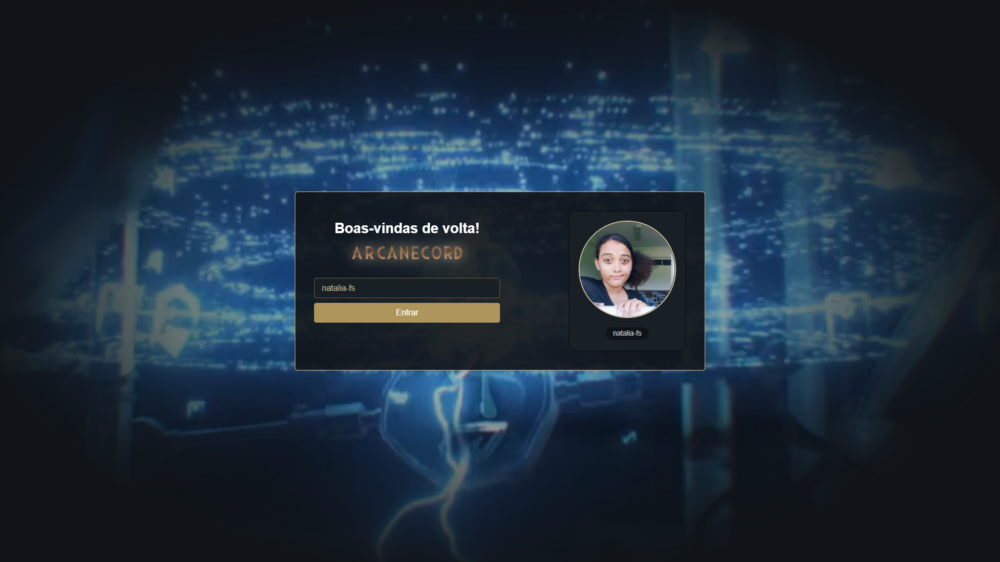

# Arcanecord (Imersão Alura)

Chat em real-time, baseado na interface gráfica do Discord.

| :placard: Vitrine.Dev |     |
| -------------  | --- |
| :sparkles: Nome        | **Arcanecord**
| :label: Tecnologias | React, Next.js, Supabase, SkynexUi, HTML, CSS
| :rocket: URL         | https://arcanecord.vercel.app/
| :fire: Desafio     | Imersão React #4 (Alura)

<!-- Inserir imagem com a #vitrinedev ao final do link -->

## Detalhes do projeto

Projeto feito enquanto acompanhava as aulas da 4ª Imersão React da Alura, ministrada pelo Mário Souto e Paulo Silveira.

### Tecnologias

- ReactJS
- Next.js
- [Supabase](https://supabase.com/)
- [SkynexUi](https://github.com/skynexui/components)

### Preview

Você pode acessar e testar o Arcanecord por aqui: https://arcanecord.vercel.app

OBS: O supabase desativa as instâncias que ficam paradas por mais de 7 dias, então pode ser que uma mensagem de erro seja exibida após realizar login

<!--  -->
